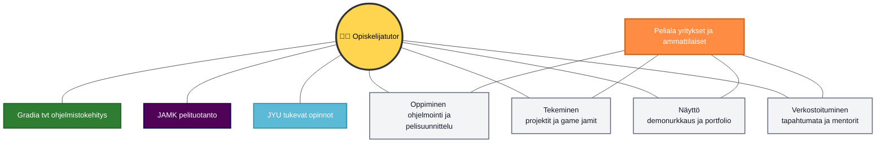
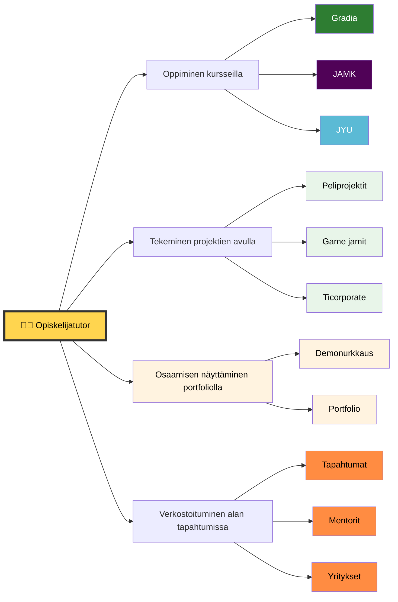
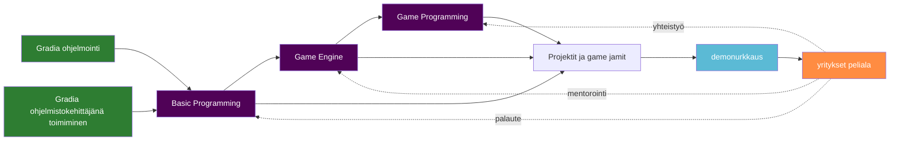

# Pelipolku: Opiskelijatutorin ohjesivu

Tämä sivu kokoaa Gradian opiskelijatutorille yhteen paikkaan keskeiset ohjeet, opintolinkit ja toimintamallit, kun tutorointi liittyy pelialan ristiinopiskeluun (Gradia x JAMK, tarvittaessa JYU-yhteistyö).

## Kenelle sivu on tarkoitettu?

- Gradian TVT-alan opiskelijalle, joka toimii tutorina pelipolulla
- Opiskelijalle, joka auttaa muita suunnittelemaan opintojen etenemistä pelialalle

## Mitä tutor tekee käytännössä?

- Auttaa opiskelijaa hahmottamaan opintopolun Gradia -> JAMK -> työelämä
- Ohjaa opiskelijaa oikeisiin opintojaksoihin ja hakemaan lisätietoa ajoissa
- Tukee projektityöskentelyssä (esim. game jamit, InnoFlash, TiCorporate)
- Kannustaa portfolion rakentamiseen ja verkostoitumiseen

## Opintolinkit yhteen paikkaan

### JAMK tutkinto ja kurssit

- JAMK tutkinto: [Game Production -tutkinto-ohjelma](https://opetussuunnitelmat.peppi.jamk.fi/48/en/59/21547/1400)
- [Basic Programming](https://opetussuunnitelmat.peppi.jamk.fi/course/HG00CI46)
- [Game Programming](https://opetussuunnitelmat.peppi.jamk.fi/course/HG00CI44)
- [Game Engine](https://opetussuunnitelmat.peppi.jamk.fi/course/HG00CI47)

### Gradia tutkinto ja opintojaksot

- [Tieto- ja viestintätekniikan perustutkinto](https://eperusteet.opintopolku.fi/#/fi/ammatillinen/6779583/tutkinnonosat)
- [Ohjelmointi](https://eperusteet.opintopolku.fi/#/fi/ammatillinen/6779583/tutkinnonosat/6810819)
- [Ohjelmistokehittäjänä toimiminen](https://eperusteet.opintopolku.fi/#/fi/ammatillinen/6779583/tutkinnonosat/6810820)

## Tutorin toimintamalli opiskelijan tukemiseksi

## Etenemisen suositusaikajana

## Käytännön muistilista tutorille

- Varmista, että opiskelija löytää oikeat kurssikuvaukset linkeistä
- Tarkista, mitä osaamista opiskelija on jo hankkinut (hyväksiluku)
- Ohjaa opiskelija mukaan tapahtumiin: game jam, hackathon, InnoFlash, TiCorporate
- Suunnittele portfolioon 2-3 projektia
- Sopikaa seurantapiste 1-2 kuukauden päähän

## Usein kysytyt kysymykset

### 1) Pitääkö osata ohjelmoida etukäteen?

Ei välttämättä. Polku alkaa perusteista, mutta oma harjoittelu nopeuttaa etenemistä.

### 2) Missä järjestyksessä kurssit kannattaa tehdä?

Aloita Basic Programming -kurssilla, jatka Game Engine- ja Game Programming -kursseihin.

### 3) Miten tutor tukee eniten?

Selkein tuki tulee siitä, että tutor auttaa polusta kiinnostuneita, tekee yhteistyösä muiden tutorien kanssa.

## Yhteenveto

Opiskelijatutorin tehtävä on tehdä pelipolku näkyväksi ja käytännönläheiseksi: oikeat kurssit, oikea-aikainen tuki, aidot projektit ja jatkuva palautesykli. Tämä sivu toimii keskitettynä pikaoppaana arjen tutorointiin, ja sitä päivitetään tarpeen mukaan.